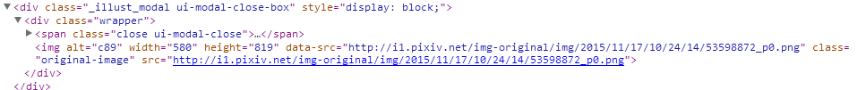

平时逛pixiv，上面有很多很赞的画师，还有很多喜欢的图片。有时就想把这些图片都扒下来保存到本地。那么，这篇博客就来讲讲如何借助Python爬虫来抓图。

**pixiv网站更新过后本篇中的登录代码已不能使用，仅供学习参考**

在开始之前，先确认电脑中安装了下面两个工具：

* [Python 2.7](https://www.python.org/downloads/windows/)
* [beautifulsoup4](http://www.crummy.com/software/BeautifulSoup/bs4/download/4.3/)

在之前两篇博客中已经介绍过部分有关Python自带的urllib的使用和BeautifulSoup的解析方法。接下来，将借助这两个工具来模拟浏览器登录、下载图片。

在现今的pixiv网站中要查看一个画师的作品前，必须先登陆账号。在浏览器中登陆账号会在本地保留Cookie，然后网站通过检测Cookie来判断是否登陆。所以第一步就是使用Python模拟登陆，然后保留Cookie。

打开浏览器登陆pixiv账号，打开审查元素中的==Network== -&gt; ==Other==，可以看到刚才登录操作浏览器是向login.php接口发送了一个请求（具体请求的URL看General），请求头和请求内容如下图：


下面是Python发送请求模拟登陆的代码：

```
import urllib, urllib2, cookielib

pixiv_url = 'http://www.pixiv.net/'
member_url = 'http://www.pixiv.net/member_illust.php'
def pixiv_login(my_id, my_pass):
    cookies = cookielib.CookieJar()
    postdata = urllib.urlencode({'pixiv_id':my_id,'pass':my_pass,'mode':'login','skip':'1'})
    opener = urllib2.build_opener(urllib2.HTTPCookieProcessor(cookies))
    opener.addheaders = [("User-Agent","Mozilla/5.0 (Windows NT 6.1; WOW64) AppleWebKit/537.36 (KHTML, like Gecko) Chrome/45.0.2454.101 Safari/537.36")
                         ,("Referer",'http://www.pixiv.net/'),("Accept","image/webp,image/*,*/*;q=0.8")]
    request  = urllib2.Request(url = 'https://www.secure.pixiv.net/login.php',data = postdata)
    opener.open(request)
    return opener # to get login information(cookies)
```

那么现在可以通过返回的opener来自由访问pixiv。
接下来来看一个画师的主页，了解一下如何解析网页来找到图片URL下载地址。

打开一个画师的作品列表，看地址栏：


地址是通过get请求，参数为页数，画师id来获取网页的。

查看作品列表的HTML代码：


列表中包含了各张作品的网址链接，在BS使用中介绍过如何使用CSS筛选器筛选标签，这里不再赘述。

```
from bs4 import BeautifulSoup
def scan_id(pid):
    global member_url, pixiv_url, opener
    for page_index in range(1, 1001): # 扫面1000页作品
        data = urllib.urlencode({'id':pid, 'type':'all', 'p':page_index})
        request = urllib2.Request(member_url + '?' + data)
        response = opener.open(request)
        soup = BeautifulSoup(response.read())
        if not soup.select('li.image-item'): # 没有这一页的话跳出
            break
        for a in soup.select('li.image-item'):
            get_pixiv_image(pid, pixiv_url + a.a.get('href')) # get all image url and download

```

接下来看看具体每一张作品的HTML网页代码，找到对应的标签和下载URL。在Pixiv上有单张作品，漫画，动图三种作品类型。

点开一张单张作品的网页



有两个地址，一个是当前显示的小图，另一个是大图，大图才是我们要的url地址。

接下来是漫画类型


找到超链接再次跳转，然后这个页面里所有img就都是我们要的


最后一种是动画，先打开一个动画作品
动画的作品地址比较难找，具体地址如下：
找到一个id=wrapper的div标签，在里面找到一个class=layout-a的div，然后在它上面有一个script脚本。pixiv上的动画就是通过这个脚本一帧帧显示出来的。里面有我们需要的地址。（这个是我个人的解析方法）


在里面这一堆脚本中可以找到一个src，是一个zip文件，这个就是我们要下载的动图文件

人为的分析完这三种网页代码之后，接下来就是借助BS来解析获取作品的下载地址：

```
url_queue = Queue.Queue()
def get_pixiv_image(pid, url):
    global url_queue, pixiv_url, opener
    response = opener.open(url)
    soup = BeautifulSoup(response.read())
    if not soup.select('.original-image'):
        if soup.select('._work.multiple'): # 漫画类型
            url = pixiv_url + soup.select('._work.multiple')[0].get('href')
            soup = BeautifulSoup(opener.open(url).read())
            if soup.select('.item-container'):
                for a in soup.select('.item-container'): # 全部下载
                    url_queue.put((pid, a.img.get('data-src')))
        else: # 动画类型
            if soup.select('div.layout-a'):
                script = soup.select('div.layout-a')[0].previous_sibling.string
                (a, b) = (script.find('http:\/\/'), script.find('.zip'))
                if a != -1 and b != -1:
                    url_queue.put((pid, script[a:b+4].replace('\\','')))
    else: # 单张作品
        url_queue.put((pid, soup.select('.original-image')[0].get('data-src')))
```

对于这种下载程序，一般说来使用多线程更加高效。所以这里使用了一个队列来存储下载链接，以供线程下载。

这里写了一段比较暴力的下载代码

```
def new_file(pid):
    path = os.getcwd() + '\\' + pid
    if not os.path.exists(path):
        os.makedirs(path)

def download_image():
    global url_queue, isFinish, opener
    while True:
        (pid, url) = ('', '')
        if url_queue.empty(): break
        else:
            (pid, url) = url_queue.get()
            response = opener.open(url)
        if pid and url:
            new_file(pid)
            filename = pid + '/' + url.split('/')[-1]
            if not os.path.exists(filename):
                savefile = open(filename,'wb')
                savefile.write(response.read())
                savefile.close()
```

结语：这篇post主要是讲如何利用python实现在pixiv上的抓图功能，代码中仍有很多不足可以改进。但是作为我Python入门的小实验，对我的学习也是相当有启发的。有错之处望指正。
