* Chapter
{:toc}

#### Chapter 2
> Listen to what one says and look at what one does. \-\-Confucian

The recommendation system based on **user behavior** only usually called **collaborative filtering**. This book mainly introduced three algorithms, [**neighborhood-based**](#neighbood-based), [**latent factor model**](#lfm), and [**random walk on graph**](#random_walk_on_graph).

Before this, we need to know these definitions.
* [long tail](https://en.wikipedia.org/wiki/Long_tail)
* [explicit feedback](https://en.wikipedia.org/wiki/Relevance_feedback#Explicit_feedback)
* [implicit feedback](https://en.wikipedia.org/wiki/Relevance_feedback#Implicit_feedback)

<a id="neighbood-based"></a>
##### Neighborhood-based

Here are two primary neighborhood-based algorithms, named [**UserCF**](#usercf) and [**ItemCF**](itemcf).
<a id="usercf"></a>
###### UserCF
This algorithm consists of two steps:
1. Find the set of users whose interest is similar to the target user's
2. Find the item that the users in the set favorite while the target user has not heard of, and then recommand it to the target user.

The first step is to calculate the similarity of users' interest **w**. We consider that two similar users have similar item set that they has a positive feedback.

or
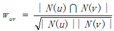
Where N(u) is the item set that user u has a positive feedback.
Here is an example in book.
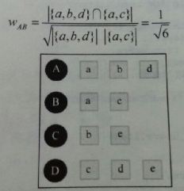
```
def UserSimilarity(train):
	W = dict()
    for u in train.keys():
    	for v in train.keys():
        	if u == v:
            	continue
            W[u][v] = len(train[u] & train[v])
            W[u][v] /= math.sqrt(len(train[u]) * len(train[v]) * 1.0)
    return W
```
The time complexity of this code is **`O(|U| *|U|)`**. Actually most of the time, there is no such item that both two users have positive feedback. That is, **`|N(u) ∩ N(v)| = 0`** usually.
Hence, we can build the inverse table of items to users.
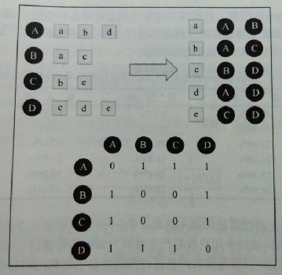
Assume user u and user v belong to the user list of K common items, then **`C[u][v] = K`**, where C is a [sparse matrix](https://en.wikipedia.org/wiki/Sparse_matrix).
```
def UserSimilarity(train):
	# build inverse table for item_users
    item_users = dict()
    for u, items in train.items():
    	for i in items.keys():
        	if i not in item_users:
            	item_users[i] = set()
			item_users[i].add(u)

	# calculate co-rated items between users
    C = dict()
    N = dict()
    for i, users in item_users.items():
    	for u in users:
        	N[u] += 1
            for v in users:
            	if u == v:
                	continue
                C[u][v] += 1

    # calculate final similarity matrix W
    W = dict()
    for u, related_users in C.items():
    	for v, cuv in related_users.items():
        	W[u][v] = cuv / math.sqrt(N[u] * N[v])
    return W
```
An improved algorithm **User-IIF**: Because there are some item popular that most user will have positive feedback, which can not reflect the similarity, User-IIF is put forward. In this method, it is considered that the unpopular items is better to reflect the similarity of two users. The improved formula of similarity is as follows:
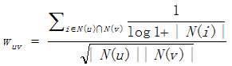
```
def UserSimilarity(train):
	# build inverse table for item_users
    item_users = dict()
    for u, items in train.items():
    	for i in items.keys():
        	if i not in item_users:
            	item_users[i] = set()
			item_users[i].add(u)

	# calculate co-rated items between users
    C = dict()
    N = dict()
    for i, users in item_users.items():
    	for u in users:
        	N[u] += 1
            for v in users:
            	if u == v:
                	continue
                C[u][v] += 1 / math.log(1 + len(users))

    # calculate final similarity matrix W
    W = dict()
    for u, related_users in C.items():
    	for v, cuv in related_users.items():
        	W[u][v] = cuv / math.sqrt(N[u] * N[v])
    return W
```
It is the second step now. In UserCF, it will return the items that the K most similar users favorite to the target user. The following formula will measure the degree of the target user's interest in items.
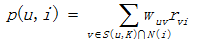
Where r<sub>vi</sub> means user v is interested in item i( *r<sub>vi</sub> is always 1* ), and w<sub>uv</sub> means the similarity between user u and user v.
```
def Recommend(user, train, W):
	rank = dict()
    interacted_items = train[user]
    for v, wuv in sorted(W[u].items, key = itemgetter(1), reverse=True)[0:K]:
    	for i, rvi in train[v].items:
        	if i in interacted_items:
            	# we should filter items user interacted before
                continue
            rank[i] += wuv * rvi
    return rank
```
<a id="itemcf"></a>
###### ItemCF
It is similar to UserCF, there are two steps mainly:
1. Find the set of items which are similar to the target item.
2. According to the similarity of items and the behavior of users, build commendation lists.

The first step is to calculate the similarity of items **w**.
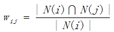
or
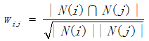
Where |N(i)| means the number of users who is interested in item i.
```
def ItemSimilarity(train):
	# calculate co-rated users between items
    C = dict()
    N = dict()
    for u, items in train.items():
    	for i in items.keys():
        	N[i] += 1
            for j in items.keys():
            	if i == j:
                	continue
                C[i][j] += 1

    # calculate final similarity matrix W
    W = dict()
    for i, related_items in C.items():
    	for j, cij in related_items.items():
        	W[i][j] = cij / math.sqrt(N[i] * N[j])
    return W
```

Here is one improved algorithm because there are some popular items that the vast majority of people are interested in them. We know, in ItemCF, the similarity w is:
, then if j is popular item, **`|N(i) ∩ N(j)| ≈ |N(i)|`**. Hence, it's put forward that w should be 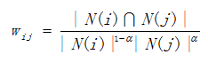, where α∈[0.5, 1].

Of course, there is another improved algorithm like User-IIF for ItemCF, called **ItemCF-IUF**(*Inverse User Frequence*): Because there are some users are very active which is interested in most items. In IUF, it is considered that these active users contribute less similarity than inactive users.
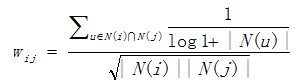
```
def ItemSimilarity(train):
	# calculate co-rated users between items
    C = dict()
    N = dict()
    for u, items in train.items():
    	for i in items.keys():
        	N[i] += 1
            for j in items.keys():
            	if i == j:
                	continue
                C[i][j] += 1 / math.log(1 + len(items) * 1.0)

    # calculate final similarity matrix W
    W = dict()
    for i, related_items in C.items():
    	for j, cij in related_items.items():
        	W[i][j] = cij / math.sqrt(N[i] * N[j])
    return W
```
**ItemCF-Norm**: The study found that it is better if normalize w, because sometimes the w differ greatly between different type.
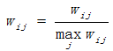
The second step is to find out K similar items and recommend to target user. Here is the formula to calculate target user's interest in item j:
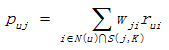
Where N(u) is the set of u's favorite items, and S(j, K) is the set of the items which are K the most similar to item j.
```
def Recommendation(train, user_id, W, K):
	rank = dict()
    ru = train[user_id]
    for i, pi in ru.items():
    	for j, wj in sorted(W[i].items(), key=itemgetter(1), reverse=True)[0:K]:
        	if j in ru:
            	continue
            rank[j].weight += pi * wj
            rank[j].reason[i] = pi * wj
    return rank
```
<a id="lfm"></a>
##### Latent Factor Model
Ususally two popular item have high simularity, because most users have behavior with them. In such cases, the recommendation system could not be based on users' behavior.
LFM is a method based on machine learning, which has better theory basis. In LFM, the formula to calculate the user u's preference to item i is defined as:
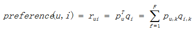
p<sub>u,k</sub> measures the relationship between user u's interest and the kth implicit class, and q<sub>i,k</sub> measures the relationship between the kth implicit class and item i.

<a id="random_walk_on_graph"></a>
##### Random Walk on Graph