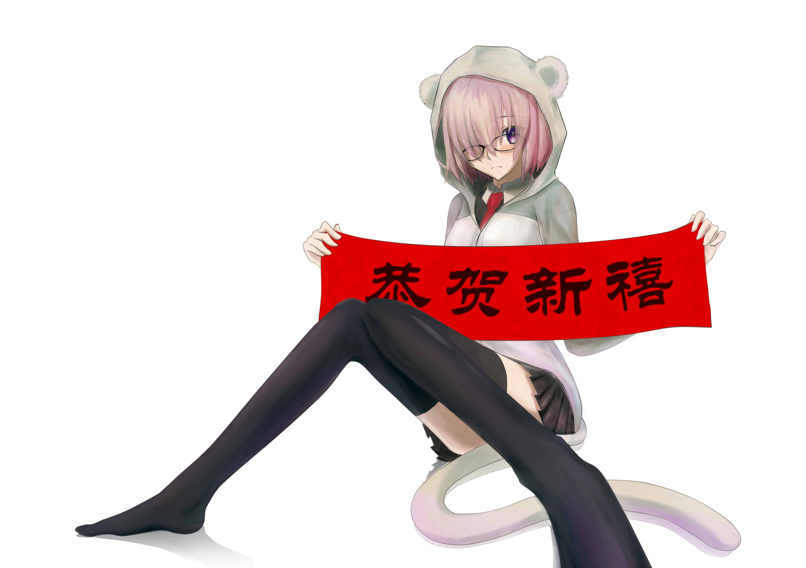

一张简单的新年河图。刚好最近在玩坑爹的Fate Grand Order，所以今年的河图猪脚就决定是盾娘。不说废话直接上成稿，不喜欢的可以直接右上角了。

放假放得晚不知不觉就过年了所以这张时间很赶就不加duang（都是借口！

放个简单粗暴的过程︿(￣︶￣)︿

粗略的草稿

描线

开始乱涂

这里开始上色的图层全部合并成一个
【正片叠底】加一层棕色

【阴影】图层随意的涂点东西上去，加水彩边缘。

【发光】图层随意抹点差不多的颜色，紫色蓝色橙红色乱涂一把，调低透明度

到这里差不多行了，擦干净出界的东西

再全部合并图层，开始修整。用笔和铅笔交换细化

加点倒影

加个【磨砂】纸质效果

成了