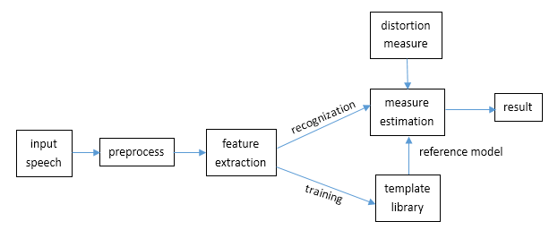
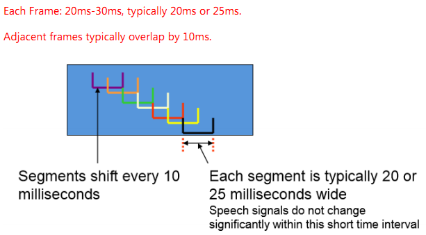
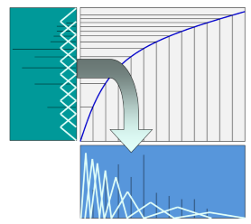

* content
{:toc}

The frame diagram of the speech recognization is as follows.

The PRS(pattern recognization system) is divided into three parts, ==feature extraction==, ==pattern matching==, and ==pattern library reference==.
This post is about feature extraction.
## What is MFCCs(Mel-frequency cepstral coefficients)?
Please look at the [definition](https://en.wikipedia.org/wiki/Mel-frequency_cepstrum)  from Wiki.
## How to extract?
##### Sampling
Usually the sampling frequency can be 8kHz, or 11kHz, or 16kHz, which must be satisfied Nyquist's theorem. Then quantization. Here is MATLAB implementation code.
```
r = audiorecorder(16000,16,1);
record(r);
stop(r);
s = getaudiodata(r,'int16');
```
##### Pre-emphasizing
Actually, the speech signal has small amplitude at high frequency. So it need a first order highpass filter(pre-emphasizing filter). The time domain expression of the filter is <code>x<sub>p</sub>[n]=x[n]-ux[n-1]</code>, and the frequency domain expression is <code>H(z)=1-uz<sup>-1</sup></code>. Typical value of `u=0.95`.
```
float spre[num_of_data-1];
for(int i = 0 ; i < num_of_data-1 ; i ++)
  spre[i] = init_data[i+1] - 0.95*init_data[i];
```
##### Framing
Short-time stationary assumption: The speech signal is a kind of typical non-stationary signal, it can be assumed that it's short-time stationary because the spectrum and physical characteristic of signal does not change significantly within a short time interval(10ms-20ms).
After framing, the signal can be analyzed with the same method with smooth process signal. That's why it need to framing first.
Adjacent frames typically overlap by 10ms, and the length of each frame is 20ms-30ms, typically 20ms or 25ms.

```
int M = 320; //as the sample frequency is 16000,then 20ms means 320 samples
int num_of_frame = num_of_data / 160 - 1;
assert(num_of_frame > 0); // ensure num_of_frame is larger than zero
float fra[num_of_frame][M];
for(int i = 0 ; i < num_of_frame ; i ++)
  for(int j = 0 ; j < M ; j ++)
    fra[i][j] = spre[i*160+j];
```
##### Windowing
In order to maintain the stability of the signal, it need to [window](http://baike.baidu.com/link?url=6LzxngTweHUtnsJT6G5qHjFdE9fWBVb3xfnYvafEWaOK2WH-PH0o5JH4RZ3USF4q0phYPcIS2izmFM2x1LLGIK) for each frame, which can reduce the energy leaking problem. Otherwise it will lead to the *Gibbs effect*. Typical window functions are Cosine window, Rectangular window, Hamming window, Hanning window, Blackman window and etc.
```
float win[M];
float data[num_of_frame][512];
memset(data,0,num_of_frame * 512 * sizeof(float));
//initialize all 512 columns that is ,padding zero after the data.
for(int i = 0 ; i < M ; i ++)
  win[i] = 0.54 - 0.46 * cos(2.0 * PI * i / M); // Hamming window
for(int i = 0 ; i < num_of_frame ; i ++)
  for(int j = 0 ; j < M ; j ++)
    data[i][j] = fra[i][j] * win[j];
```
##### Zero-Padding
Radix 2 FFTs require signals of length 2<sup>n</sup>. It is necessary to pad the signal to increase its length(add zero after each frame) to the appropriate number.
##### FFT and Power
Convert the signal into frequency signal by FFT, then compute the power spectrum.
```
float power[num_of_frame][512];
memset(power , 0 , num_of_frame * 512 * sizeof(float));
for(int i = 0 ; i < num_of_frame ; i ++){
  FFT_and_power(data , i , 512); //omitted here
  for(int j = 0 ; j < 512 ; j ++)
    power[i][j] = temp[j];
}
```
##### Warping the frequency to Mel scale
Mel scale is close to human auditory system. Thus, use 40 triangle filter to warp the frequency to Mel scale. These filters is uniform distribution on Mel scale.

```
float fre2mel(float fre){
  return 1127.0 * log(1 + fre / 700.0);
}
float mel2fre(float mel){
  return 700 * (exp(mel / 1127) - 1);
}
struct tri_filter{
  float low , mid , high;
  tri_filter(float l=0,float m=0,float h=0):low(l),mid(m),high(h){}
};

...

int num_of_filter = 40;
float num_temp = fre2mel(16000 / 2) / (num_of_filter + 2);
// divide fs/2 as 42 parts, as each filter have three points--low , mid, high
tri_filter Tri_filter[40];
for (int i = 0 ; i < 40 ; i ++){
  Tri_filter[i].low  = mel2fre((i + 0) * num_temp) / 8000 * 256;
  Tri_filter[i].high = mel2fre((i + 2) * num_temp) / 8000 * 256;
  Tri_filter[i].mid = (Tri_filter[i].low + Tri_filter[i].high) / 2.0;
}
float filter[num_of_filter][256];
for(int i = 0 ; i  < num_of_filter ; i ++)
  for(int j = 0 ; j < 256 ; j ++)
    if(j > Tri_filter[i].low && j < Tri_filter[i].mid){
	  filter[i][j] = (j - Tri_filter[i].low) / (Tri_filter[i].mid - Tri_filter[i].low);
	}
	else if(j < Tri_filter[i].high && j >= Tri_filter[i].mid){
	  filter[i][j] = (Tri_filter[i].high - j) / (Tri_filter[i].high - Tri_filter[i].mid);
  	}
	else filter[i][j] = 0;
```
##### Filtering
```
float Xf[num_of_frame][num_of_filter];
for (int i = 0 ; i < num_of_frame ; i ++){//for each frame
  for (int j = 0 ; j < num_of_filter ; j ++){//for each filter
    float temp = 0;
    for (int k = 0 ; k < 256 ; k ++)//we should only use half of the data
        temp += power[i][k] * filter[j][k];
    Xf[i][j] = temp;
  }
}
```
##### Calculate the cepstral
```
for (int i = 0 ; i < num_of_frame ; i ++)//for each frame
  for (int j = 0 ; j < num_of_filter ; j ++)  //for each filter
    if(Xf[i][j] < 0)
      Xf[i][j] = -log(-Xf[i][j]);
    else
      Xf[i][j] = log(Xf[i][j]);
```
##### DCT
Get the first 13 coefficients of DCT.
```
int L = 13;//get the first 13 coefficients of DCT
float DCT[num_of_frame][L];
memset(DCT , 0 , num_of_frame * L * sizeof(float));
for (int i = 0 ; i < num_of_frame ; i ++)
  for (int j = 0 ; j < L ; j ++)
	for(int k = 0 ; k < num_of_filter ; k ++)
      DCT[i][j] += Xf[i][k] * cos(PI * j * (k + 0.5) / num_of_filter);
      // DCT -- C-recording
```
##### Mean Subtraction and Variance Normalization
Noise, channel and speaker variations change the distribution of cepstral values. We need to eliminate these influence.
```
float sum=0,SD=0;
for (int i = 0 ; i < L ; i ++)
  for (int j = 0 ; j < num_of_frame ; j ++)
    sum += DCT[j][i];
sum /= (num_of_frame * L);

for(int i = 0 ; i < num_of_frame ; i ++)
  for(int j = 0 ; j < L ; j ++){
    DCT[i][j] -= sum;
    SD += pow(DCT[i][j] , 2.0);
  }
SD = sqrt(SD / L / num_of_frame);

for(int i = 0 ; i < num_of_frame ; i ++)
  for(int j=0;j<L;j++)
    DCT[i][j] /= SD;
```